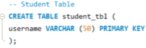
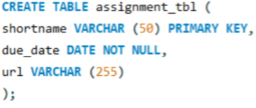
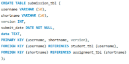
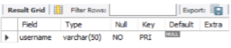
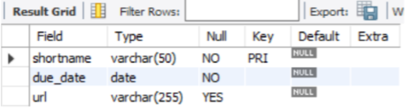
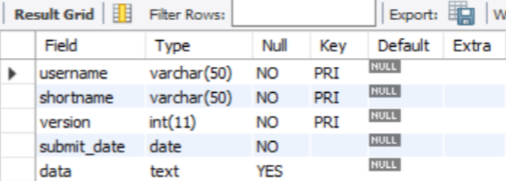
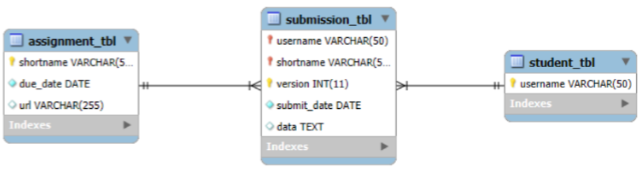

[←𝗚𝗼 𝗕𝗮𝗰𝗸](https://dtx-byte.github.io/Dxt_EDMPortfolio/)
# [Finals-Lab-Task-2](https://github.com/Dtx-byte/Final-Lab-Task-2/blob/main/Images/Dexter_FLT2.docx)
- This portfolio demonstrates my understanding of MySQL database creation using a simplified student assignment submission system. It covers the step-by-step creation of tables representing students, assignments, and their submissions. This exercise applies data types, relationships, and constraints like primary keys, foreign keys, and composite keys to build a fully functional relational schema.

# Step By Step Process
### 1. Create the student table:
- Define username as a VARCHAR(50).
- Set username as the Primary Key.

### 2. Create the assignment table:
- Define shortname as a VARCHAR(50) and set it as the Primary Key.
- Define due_date as a DATE NOT NULL.
- Define url as a VARCHAR(255), which can be null.

### 3. Create the submission table:
- Define username and shortname both as VARCHAR(50).
- Define version as an INT.
- Define submit_date as a DATE NOT NULL.
- Define data as TEXT.
- Set a composite primary key of (username, shortname, version).
- Add foreign keys referencing the student and assignment tables.

# Table Relationships
### 1. **`student` table**
- **Primary Key:** `username`
- **Relationships:**
  - **One-to-Many** relationship with `submission`
    - One student (`username`) can have **many submissions**.

### 2. **`assignment` table**
- **Primary Key:** `shortname`
- **Relationships:**
  - **One-to-Many** relationship with `submission`
    - One assignment (`shortname`) can have **many submissions** from different students (or multiple versions from the same student).

### 3. **`submission` table**
- **Composite Primary Key:** `(username, shortname, version)`
- **Relationships:**
  - **Many-to-One** with `student`
    - Each submission belongs to **one student**.
  - **Many-to-One** with `assignment`
    - Each submission is for **one assignment**.
  - Overall, it represents a many-to-many relationship between students and assignments, with a version to track multiple submissions.

# Screenshots
## Query Statements
1. Student Table
- 

2. Assignment Table
- 

3. Submission Table
- 

## Table Structure
1. Student Table
- 

2. Assignment Table
- 

3. Submission Table
- 
  
## EER Diagram
- 
